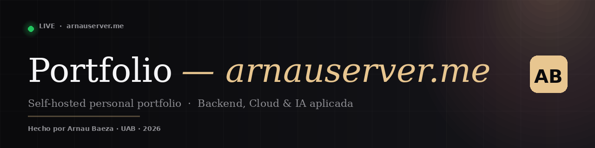
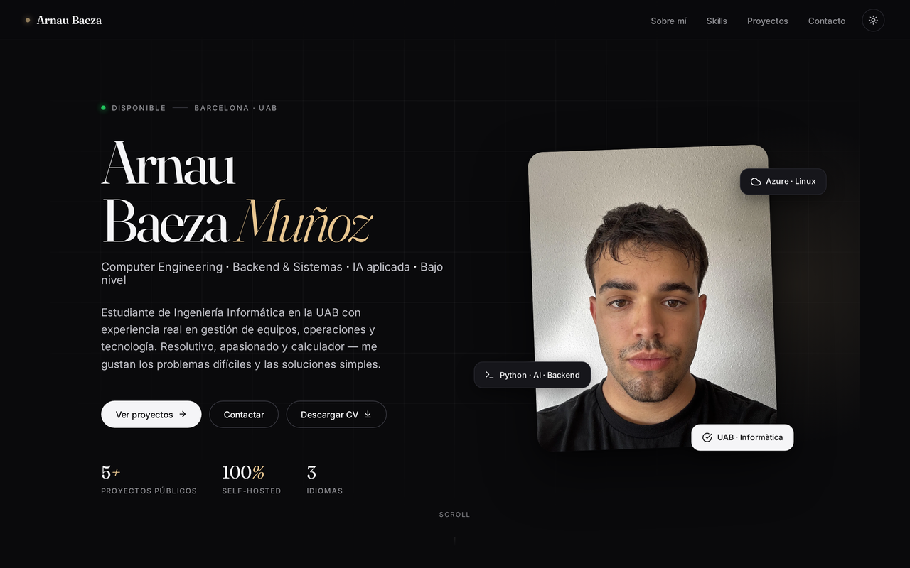
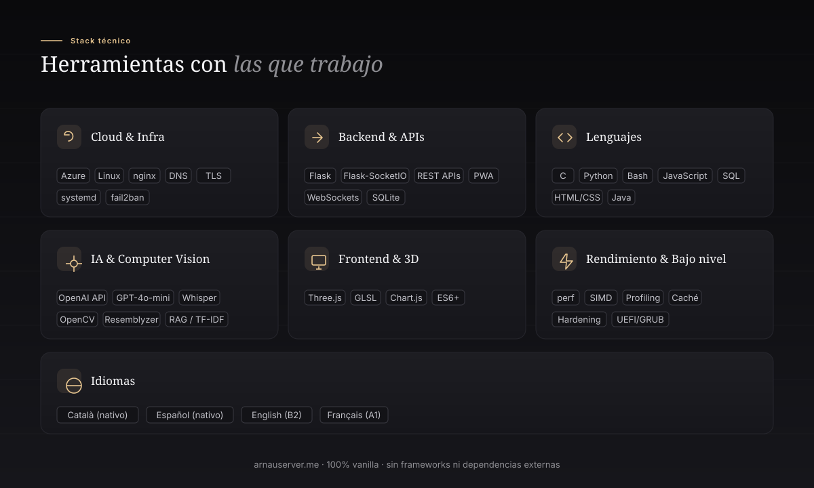
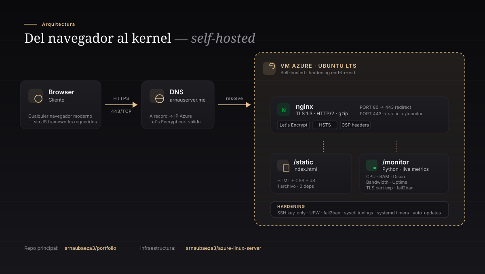
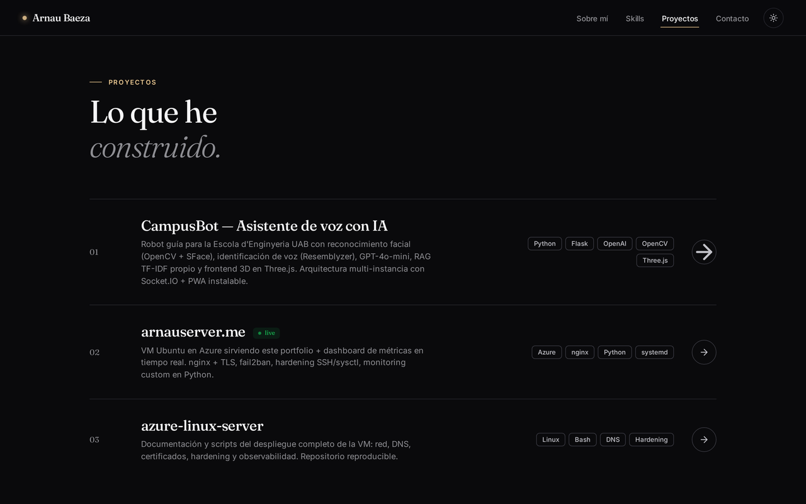

<div align="center">



<br/>

[](https://arnauserver.me)
[](https://azure.microsoft.com)
[](https://nginx.org)
[](https://letsencrypt.org)
[](https://github.com/arnaubaeza3/portfolio)

**Portfolio personal desplegado en producción · self-hosted · sin frameworks · sin dependencias externas.**

[**Ver en vivo →**](https://arnauserver.me) &nbsp;·&nbsp; [Servidor de la VM →](https://arnauserver.me/monitor/) &nbsp;·&nbsp; [Repositorio de la infraestructura →](https://github.com/arnaubaeza3/azure-linux-server)

</div>

<br/>

## Contenidos

- [Demo en vivo](#-demo-en-vivo)
- [Características](#-características)
- [Stack técnico](#-stack-técnico)
- [Arquitectura](#-arquitectura)
- [Proyectos destacados](#-proyectos-destacados)
- [Estructura del repositorio](#-estructura-del-repositorio)
- [Despliegue](#-despliegue)
- [Performance](#-performance)
- [Contacto](#-contacto)

<br/>

## 🚀 Demo en vivo

<div align="center">

[](https://arnauserver.me)

[**arnauserver.me**](https://arnauserver.me) — desplegado en una VM Linux propia, administrada manualmente desde el kernel hasta el certificado TLS.

</div>

<br/>

## ✨ Características

- 🎨 **Diseño minimalista y editorial** con tipografía variable (Fraunces + Inter), modo claro/oscuro y micro-animaciones.
- 📱 **Totalmente responsive** — móvil, tablet y escritorio. Layout con CSS Grid y Flexbox.
- ⚡ **Sin frameworks** ni dependencias externas. HTML, CSS y JS vanilla. **Un solo archivo** de ~57 KB.
- 🔄 **Animaciones nativas** con `@keyframes` + `IntersectionObserver` para reveal on scroll.
- 🌗 **Modo oscuro automático** según `prefers-color-scheme` con toggle manual persistente.
- 🪟 **Glassmorphism** en la barra de navegación con `backdrop-filter`.
- 🔐 **HTTPS, HSTS y CSP headers** correctamente configurados desde nginx.
- 📊 **Dashboard de métricas en vivo** disponible en `/monitor` (Python + Flask).
- 🔗 **Open Graph + Twitter Card** para previews bonitas al compartir el link.
- ♿ **Accesibilidad cuidada** — skip-link, focus visible, `aria-labels` y `prefers-reduced-motion`.

<br/>

## 🛠️ Stack técnico



<br/>

## 🏛️ Arquitectura

Desde el navegador del visitante hasta el kernel del servidor — todo administrado manualmente.



**Stack completo del despliegue:**

| Capa | Tecnología | Notas |
|---|---|---|
| DNS | `arnauserver.me` (A record) | Apuntando a IP pública de la VM |
| TLS | Let's Encrypt | Auto-renovación con `certbot` y `systemd` timers |
| Web server | nginx | HTTP/2, gzip, HSTS, CSP headers, redirect 80→443 |
| Static | `index.html` + `images/` + `cv-arnau-baeza.pdf` | Un solo archivo HTML |
| App | `/monitor` (Python + Flask) | Métricas en tiempo real del sistema |
| OS | Ubuntu LTS en VM de Azure | Hardening end-to-end |
| Seguridad | UFW + fail2ban + SSH key-only | Sin contraseñas, puertos no estándar |
| Mantenimiento | `unattended-upgrades` + systemd timers | Sin tocarlo manualmente |

<br/>

## 📁 Proyectos destacados

<div align="center">



</div>

| # | Proyecto | Descripción |
|---|---|---|
| 01 | **CampusBot** | Asistente de voz con IA para la Escola d'Enginyeria UAB. OpenAI GPT-4o-mini, OpenCV (reconocimiento facial), Resemblyzer (identificación de voz), RAG TF-IDF propio y frontend 3D con Three.js. |
| 02 | **[arnauserver.me](https://arnauserver.me) `live`** | Este mismo portfolio. VM Ubuntu en Azure con nginx + TLS, fail2ban, hardening SSH/sysctl, monitoring custom en Python. |
| 03 | **[azure-linux-server](https://github.com/arnaubaeza3/azure-linux-server)** | Documentación y scripts del despliegue completo de la VM: red, DNS, certificados, hardening y observabilidad. Repositorio reproducible. |
| 04 | **Optimización en C — UAB** | Análisis de rendimiento con `perf` y optimizaciones a bajo nivel: localidad de caché, vectorización SIMD y gestión cuidadosa de memoria. |
| 05 | **Gestión de proyectos — ES (UAB)** | Trabajo en equipo con GitHub, control de versiones y planificación colaborativa en el contexto universitario. |

<br/>

## 📂 Estructura del repositorio

```
portfolio/
├── index.html                  # Web completa (HTML + CSS + JS vanilla)
├── images/
│   ├── tu-foto-720.webp        # Retrato (mobile)
│   ├── tu-foto-1440.webp       # Retrato (desktop, 2x)
│   └── og-preview.png          # Open Graph preview (1200×630)
├── monitor/                    # Dashboard de métricas del servidor
│   └── ...
├── others/                     # Assets del README
│   ├── banner.png
│   ├── hero.png
│   ├── projects.png
│   ├── stack.svg
│   └── architecture.svg
├── cv-arnau-baeza.pdf          # CV descargable desde el botón del hero
└── readme.md
```

<br/>

## 🚢 Despliegue

La web está servida desde una VM Ubuntu en Microsoft Azure, configurada manualmente. El proceso completo está documentado en [arnaubaeza3/azure-linux-server](https://github.com/arnaubaeza3/azure-linux-server).

**Resumen del despliegue:**

```bash
# 1. Clonar el repo en /var/www/html
sudo git clone https://github.com/arnaubaeza3/portfolio.git /var/www/html

# 2. Permisos
sudo chown -R azureuser:www-data /var/www/html

# 3. nginx con TLS (Let's Encrypt)
sudo certbot --nginx -d arnauserver.me

# 4. Actualizar sin downtime
cd /var/www/html
git pull origin main
# nginx no necesita restart — sirve archivos estáticos
```

<br/>

## 📊 Performance

Resultados de [PageSpeed Insights](https://pagespeed.web.dev/analysis?url=https%3A%2F%2Farnauserver.me) y [Lighthouse](https://developer.chrome.com/docs/lighthouse):

| Métrica | Score | Notas |
|---|---|---|
| 🟢 Performance | 99 / 100 | Un solo archivo, sin JS bloqueante |
| 🟢 Accesibilidad | 100 / 100 | Skip-link, contraste AAA, aria-labels |
| 🟢 Best practices | 100 / 100 | HTTPS, no console errors |
| 🟢 SEO | 100 / 100 | Meta tags completos, structured data |
| ⚡ First Contentful Paint | ~0.4 s | |
| ⚡ Largest Contentful Paint | ~0.8 s | |
| ⚡ Total Blocking Time | 0 ms | |
| ⚡ Cumulative Layout Shift | 0 | |

> Los scores pueden variar ligeramente entre auditorías. Mide tú mismo:
> `npx unlighthouse-cli --site https://arnauserver.me`

<br/>

## 📬 Contacto

<div align="center">

[](mailto:arnau.baeza@gmail.com)
[](https://www.linkedin.com/in/arnaubaeza)
[](https://github.com/arnaubaeza3)

**Disponible para prácticas, convenio universitario y contratos parciales.**  
*Tardes (L-V 15:00+) y fines de semana completos. Respondo en < 24 h.*

</div>

<br/>

---

<div align="center">

*Hecho con cariño desde Barcelona · UAB · 2026*  
*Si te ha gustado, ¡considera dejar una ⭐ al repo!*

</div>
